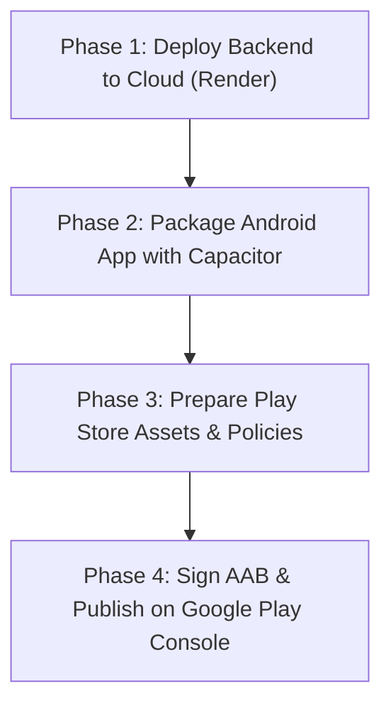

# ParkShare Google Play Store Publishing Guide

This guide covers everything required to take **ParkShare** from local development to a live, published Android app on the **Google Play Store**.

---

## 📋 The 4-Phase Roadmap



---

## 🚀 Phase 1: Deploy the Backend to Cloud (Render)

Because physical Android phones cannot connect to `http://localhost:8000`, the FastAPI backend and PostgreSQL database must be hosted on the internet with a public `https://` URL.

### Step 1.1: Push Code to GitHub
1. Open PowerShell in your project root (`c:\Users\VASANTH A\.gemini\antigravity\scratch\parkshare`):
   ```bash
   git add .
   git commit -m "Configure production deployment and Play Store readiness"
   ```
2. Create a new repository on [GitHub](https://github.com/new) named `parkshare` (public or private).
3. Push your repository:
   ```bash
   git branch -M main
   git remote add origin https://github.com/<YOUR_GITHUB_USERNAME>/parkshare.git
   git push -u origin main
   ```

### Step 1.2: Deploy on Render with 1-Click Blueprint
1. Go to [Render Dashboard](https://dashboard.render.com/) (Sign in with your GitHub account).
2. Click **New +** (top right) $\rightarrow$ **Blueprint**.
3. Select your `parkshare` repository.
4. Render automatically reads our configured [`render.yaml`](./render.yaml) and provisions:
   - **`parkshare-db`**: Free Managed PostgreSQL Database
   - **`parkshare-backend`**: FastAPI Python Web Service (with Razorpay test keys preconfigured)
5. Click **Apply**.
6. Once deployed (approx. 2-3 minutes), Render will give you a public URL for your backend:
   ```
   https://parkshare-backend.onrender.com
   ```
7. Verify it in your browser: `https://parkshare-backend.onrender.com/health` should return `{"status": "ok"}`.

---

## 📱 Phase 2: Convert `customer-web` to Android (Capacitor)

We use **Capacitor** (by Ionic) to wrap your React/Vite customer app into an official Android Studio project.

### Step 2.1: Install Capacitor in `customer-web`
In `customer-web/`:
```bash
cd customer-web
npm install @capacitor/core @capacitor/cli @capacitor/android
npx cap init "ParkShare" "com.parkshare.customer" --web-dir dist
```

### Step 2.2: Set the Production Backend URL
Create a file `customer-web/.env.production`:
```env
VITE_API_URL=https://parkshare-backend.onrender.com
```

### Step 2.3: Build & Add Android Platform
```bash
npm run build
npx cap add android
npx cap sync
```
This generates the full `android/` native project folder!

### Step 2.4: Configure Android Permissions
In `android/app/src/main/AndroidManifest.xml`, ensure the following permissions are present:
```xml
<!-- Internet & Network -->
<uses-permission android:name="android.permission.INTERNET" />
<uses-permission android:name="android.permission.ACCESS_NETWORK_STATE" />

<!-- Camera for Odometer & Vehicle Photos -->
<uses-permission android:name="android.permission.CAMERA" />
<uses-feature android:name="android.hardware.camera" android:required="false" />

<!-- Location for finding nearby parking -->
<uses-permission android:name="android.permission.ACCESS_FINE_LOCATION" />
<uses-permission android:name="android.permission.ACCESS_COARSE_LOCATION" />
```

---

## 🎨 Phase 3: Google Play Store Assets & Policy Checklist

Google Play Store has strict metadata and asset guidelines:

| Asset / Requirement | Dimensions / Format | Description |
| :--- | :--- | :--- |
| **App Name** | Max 30 chars | `ParkShare - Smart Parking` |
| **Short Description** | Max 80 chars | `Find, reserve, and pay for verified private parking spaces instantly.` |
| **Full Description** | Max 4000 chars | Detailed description of features (instant booking, live camera verification, secure Razorpay checkout). |
| **App Icon** | 512 x 512 px (PNG) | 32-bit color, high-resolution app icon. |
| **Feature Graphic** | 1024 x 500 px (JPG/PNG) | Banner displayed prominently at the top of your Play Store listing. |
| **Phone Screenshots** | Min 2, Max 8 (16:9 or 9:16) | Screenshots of Map search, Parking detail, Payment checkout, and Active bookings. |
| **Privacy Policy URL** | Mandatory HTTPS URL | Required because the app requests Camera & Location permissions. |

> [!IMPORTANT]
> **Google's 20-Tester / 14-Day Rule**:
> For personal Google Play Developer accounts created after **November 13, 2023**, Google mandates:
> - You must run a **Closed Test** with at least **20 testers** who opt-in.
> - Testers must remain opted-in for **14 continuous days** before Google allows applying for Production release.
> - You can invite friends, family, or testing groups using their Gmail addresses in the Play Console.

---

## 🔐 Phase 4: Signing Key & Building Release AAB

Google Play requires an **Android App Bundle (.aab)** signed with a production Keystore.

### Step 4.1: Generate Your Release Keystore
Run in PowerShell (Java `keytool` is already installed on your system):
```bash
keytool -genkey -v -keystore parkshare-release-key.jks -keyalg RSA -keysize 2048 -validity 10000 -alias parkshare -storepass YourSecurePassword123 -keypass YourSecurePassword123
```
*(Keep `parkshare-release-key.jks` and the password in a safe backup — you will need it for every future app update!)*

### Step 4.2: Build Signed AAB in Android Studio
1. Open Android Studio:
   ```bash
   npx cap open android
   ```
2. In Android Studio:
   - Click **Build** $\rightarrow$ **Generate Signed Bundle / APK...**
   - Select **Android App Bundle (.aab)** $\rightarrow$ Click **Next**.
   - Choose your `parkshare-release-key.jks` file, enter your password and alias.
   - Choose **release** destination folder.
   - Click **Create**.
3. Android Studio will generate the signed `.aab` file at:
   `android/app/release/app-release.aab`.

### Step 4.3: Upload to Google Play Console
1. Go to [Google Play Console](https://play.google.com/console).
2. Click **Create App** $\rightarrow$ Fill App Name, Default Language, Free/Paid.
3. Complete the **Set up your app** checklist (Privacy Policy, App Access, Ads, Content Rating, Target Audience).
4. Go to **Testing** $\rightarrow$ **Closed testing**.
5. Create a new release and drag & drop `app-release.aab`.
6. Add your 20 testers' email addresses and publish the test track!

---

## 🎯 Immediate Next Steps

1. **Step 1**: Push your project to GitHub.
2. **Step 2**: Open [Render.com](https://dashboard.render.com), click **New + > Blueprint**, and select this repo to launch the live backend.
3. Let me know once you have your live Render backend URL, and I will immediately set up Capacitor, configure permissions, and build the Android APK & AAB with you!
